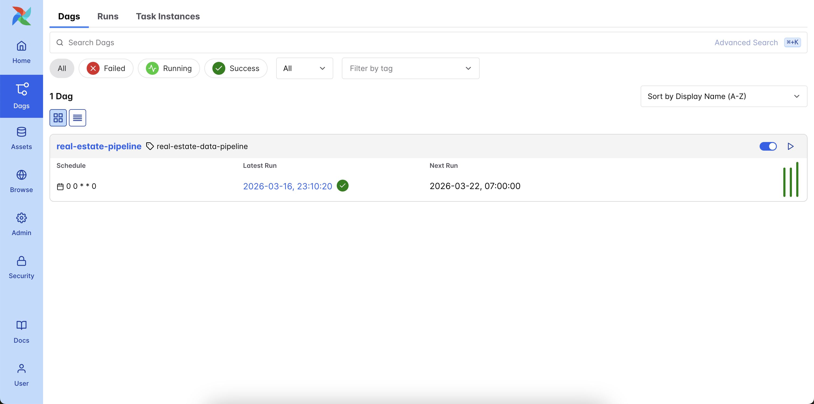
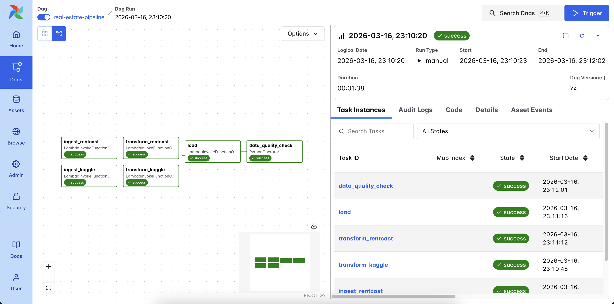
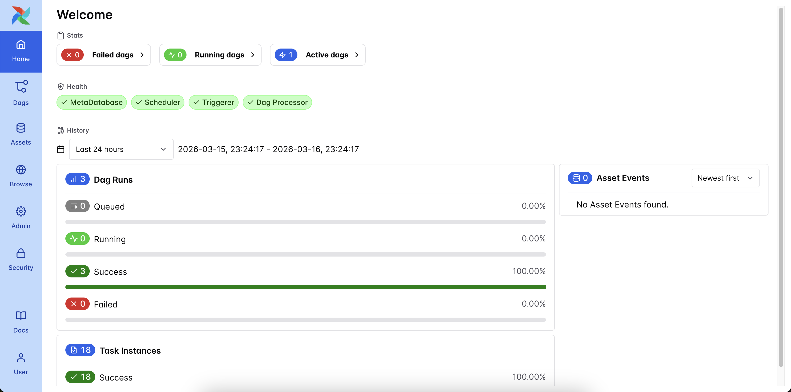

# Real Estate Data Pipeline

An end-to-end data pipeline that ingests property listing data from multiple sources, transforms it using modern
tooling, and loads it into a cloud data warehouse for analysis. The entire infrastructure is defined as code and
deployed on AWS.

## Overview

This project demonstrates a production-style ELT pipeline that combines two complementary real estate data sources:

- **Kaggle USA Real Estate Dataset** (~2.2M historical listings scraped from Realtor.com) — ingested as bulk CSV files,
  simulating a file-based data feed.
- **RentCast API** (live property records, valuations, and market statistics) — ingested via scheduled API calls,
  simulating a real-time data feed.

AWS MWAA (Managed Apache Airflow) orchestrates the entire flow: it triggers ingestion Lambdas that write raw data to S3,
triggers transformation Lambdas that clean and normalize the data using Polars and write Parquet to an S3 staging zone,
then triggers a load Lambda that uses Snowflake's COPY INTO and MERGE to load the staged data into a star schema. A
final data quality check task validates the loaded data.

The two sources are normalized independently, loaded into a star schema in Snowflake, and joined at the **aggregate
geographic level** (zip code, city, state) — not at the individual property level, since the Kaggle dataset has
anonymized street addresses. This is a deliberate design choice that mirrors real-world scenarios where data sources
don't share clean primary keys.

## Architecture

```
┌──────────────────────────────────────────────────────────────────────┐
│                            AWS MWAA                                  │
│                     (Managed Apache Airflow)                         │
│                                                                      │
│  DAG: real-estate-pipeline (@weekly)                                 │
│                                                                      │
│  ingest_kaggle ──► transform_kaggle ─────┐                           │
│                                          ├──► load ──► data_quality  │
│  ingest_rentcast ──► transform_rentcast ─┘                           │
└───┬──────────────┬──────────────────┬──────────┬─────────────────────┘
    │              │                  │          │
    ▼              ▼                  ▼          ▼
┌─────────┐  ┌──────────┐    ┌────────────┐  ┌────────────┐
│ Lambda  │  │ Lambda   │    │ Lambda     │  │ Lambda     │
│ ingest  │  │ ingest   │    │ transform  │  │ load       │
│ kaggle  │  │ rentcast │    │ (x2)       │  │            │
└────┬────┘  └────┬─────┘    └─────┬──────┘  └─────┬──────┘
     │            │                │               │
     ▼            ▼                ▼               ▼
┌─────────────────────┐   ┌─────────────────┐  ┌──────────────────┐
│  S3 Raw Zone        │   │  S3 Staging     │  │    Snowflake     │
│  raw/kaggle/        │   │  staging/       │  │                  │
│  raw/rentcast/      │   │  (Parquet)      │  │  dim_location    │
└─────────────────────┘   └─────────────────┘  │  dim_property_   │
                                               │    type          │
                                               │  fact_listings   │
                                               │  fact_market_    │
                                               │    stats         │
                                               └──────────────────┘
```

### Airflow DAG in Action

DAG list showing the weekly schedule and successful runs:



DAG run detail — all tasks green, parallel ingest/transform branches converging at load:



MWAA dashboard — 3 successful runs, 18/18 task instances passed:



## Data Sources

### Kaggle USA Real Estate Dataset

A static CSV dataset with ~2.2M US property listings. Used as the historical backbone of the pipeline.

| Column           | Description                        |
|------------------|------------------------------------|
| `brokered_by`    | Anonymized broker/agent identifier |
| `status`         | Listing status (for_sale, sold)    |
| `price`          | Listed or sold price (USD)         |
| `bed`            | Number of bedrooms                 |
| `bath`           | Number of bathrooms                |
| `acre_lot`       | Lot size in acres                  |
| `street`         | Anonymized street identifier       |
| `city`           | City name                          |
| `state`          | State name                         |
| `zip_code`       | ZIP code                           |
| `house_size`     | Interior square footage            |
| `prev_sold_date` | Previous sale date                 |

### RentCast API

A live REST API providing property records, valuations, and market data. Free tier allows 50 API calls/month.

Key endpoints used:

- `/properties` — Property records with structural attributes, geolocation, tax assessments
- `/avm/value` — Automated valuation model estimates with comparable properties
- `/listings/sale` — Active for-sale listings with price, days on market, listing contacts
- `/market-statistics` — Aggregate price and rent trends by zip code

Key fields returned include: `formattedAddress`, `city`, `state`, `zipCode`, `county`, `latitude`, `longitude`,
`propertyType`, `bedrooms`, `bathrooms`, `squareFootage`, `lotSize`, `yearBuilt`, `lastSaleDate`, `lastSalePrice`.

### Why Two Sources?

The two datasets serve different roles and **cannot be joined at the property level** because Kaggle anonymizes street
addresses. Instead, they are joined at the geographic aggregate level (zip code). This is intentional — it demonstrates
a common real-world pattern where enrichment happens across mismatched schemas.

| Aspect                | Kaggle CSV                     | RentCast API                           |
|-----------------------|--------------------------------|----------------------------------------|
| **Volume**            | ~2.2M rows                     | 50 calls/month (free tier)             |
| **Freshness**         | Static snapshot                | Live / real-time                       |
| **Granularity**       | Listing-level (anonymized)     | Property-level (full address)          |
| **Unique value**      | Historical price distributions | Valuations, geolocation, market trends |
| **Ingestion pattern** | File-based (S3 upload)         | API-based (Lambda HTTP calls)          |

## Data Model

The pipeline outputs a star schema in Snowflake:

```
         ┌──────────────────┐     ┌───────────────────────┐
         │  dim_location    │     │  dim_property_type    │
         │                  │     │                       │
         │  location_id  PK │     │  property_type_id  PK │
         │  city            │     │  property_type        │
         │  state           │     └───────────┬───────────┘
         │  zip_code        │                 │
         └────────┬─────────┘                 │
                  │                           │
      ┌───────────┼───────────────────────────┤
      │           │                           │
      ▼           ▼                           ▼
┌──────────────────────────────┐  ┌─────────────────────────┐
│ fact_listings                │  │ fact_market_stats       │
│ (Kaggle + RentCast unified)  │  │ (from RentCast)         │
│                              │  │                         │
│ listing_id          PK       │  │ stat_id            PK   │
│ location_id         FK       │  │ location_id        FK   │
│ property_type_id    FK       │  │ snapshot_date           │
│ price                        │  │ median_listing_price    │
│ status                       │  │ median_price_per_sqft   │
│ source (kaggle/rentcast)     │  │ median_days_on_market   │
│ batch_id                     │  │ total_listings          │
│ ingested_at                  │  │ new_listings            │
│ -- kaggle-specific --        │  │ batch_id                │
│ bed, bath, acre_lot          │  │ ingested_at             │
│ house_size, prev_sold_date   │  └─────────────────────────┘
│ -- rentcast-specific --      │
│ rentcast_id, address         │
│ bedrooms, bathrooms          │
│ square_footage, lot_size     │
│ latitude, longitude          │
│ days_on_market, listed_date  │
└──────────────────────────────┘
```

`fact_listings` is a **unified table** — both Kaggle and RentCast listings go into the same table with a `source`
column. Source-specific columns are nullable (e.g., `rentcast_id` is NULL for Kaggle rows, `brokered_by` is NULL for
RentCast rows).

### Example Analytical Query

```sql
-- Compare Kaggle historical prices vs RentCast listing prices by location
SELECT dl.zip_code,
       dl.city,
       dl.state,
       COUNT(CASE WHEN fl.source = 'kaggle' THEN 1 END)        AS kaggle_listings,
       COUNT(CASE WHEN fl.source = 'rentcast' THEN 1 END)      AS rentcast_listings,
       AVG(CASE WHEN fl.source = 'kaggle' THEN fl.price END)   AS avg_kaggle_price,
       AVG(CASE WHEN fl.source = 'rentcast' THEN fl.price END) AS avg_rentcast_price,
       AVG(fms.median_listing_price)                           AS market_median_price
FROM analytics.fact_listings fl
         JOIN analytics.dim_location dl ON fl.location_id = dl.location_id
         LEFT JOIN analytics.fact_market_stats fms ON fms.location_id = dl.location_id
GROUP BY dl.zip_code, dl.city, dl.state
HAVING kaggle_listings > 0
   AND rentcast_listings > 0
ORDER BY avg_rentcast_price - avg_kaggle_price DESC;
```

## Tech Stack

| Tool                                        | Role                                     | Why This Tool                                                                                                                                                                          |
|---------------------------------------------|------------------------------------------|----------------------------------------------------------------------------------------------------------------------------------------------------------------------------------------|
| **AWS Lambda**                              | Compute for ingestion and transformation | Serverless, cost-effective for scheduled batch jobs. Polars runs well within Lambda's memory limits.                                                                                   |
| **Amazon S3**                               | Data lake (raw and staging zones)        | Raw zone for ingested data, staging zone for cleaned/transformed data. Decouples each pipeline step and enables independent re-runs.                                                   |
| **Polars**                                  | Data transformation                      | Faster and more memory-efficient than Pandas — critical inside Lambda's constraints. Lazy evaluation enables handling larger-than-memory datasets.                                     |
| **Snowflake**                               | Cloud data warehouse                     | Separates compute from storage, handles semi-structured data natively, easy to demo with a free trial.                                                                                 |
| **AWS MWAA**                                | Orchestration and scheduling             | Managed Apache Airflow service — no infrastructure to maintain, integrates natively with AWS IAM, S3, and CloudWatch. DAGs provide visibility, retry logic, and dependency management. |
| **Terraform**                               | Infrastructure as Code                   | Reproducible deployments, version-controlled infrastructure, demonstrates production-readiness.                                                                                        |
| **AWS (S3, Lambda, IAM, CloudWatch, MWAA)** | Cloud infrastructure                     | Full deployment story from code to running pipeline.                                                                                                                                   |

## Repository Structure

```
real-estate-data-pipeline/
│
├── terraform/                  # Infrastructure as Code
│   ├── main.tf
│   ├── variables.tf
│   ├── outputs.tf
│   ├── modules/
│   │   ├── s3/                 # Data lake bucket
│   │   ├── lambda/             # Reusable Lambda module
│   │   ├── iam/                # Lambda execution role
│   │   ├── mwaa/               # MWAA environment, VPC, IAM
│   │   └── snowflake_iam/      # Snowflake S3 access role
│   └── environments/
│       └── dev.tfvars
│
├── lambdas/                    # Lambda function source code
│   ├── common/                 # Shared utilities (S3 helpers, etc.)
│   ├── ingest_kaggle/          # Kaggle CSV ingestion
│   ├── ingest_rentcast/        # RentCast API ingestion
│   ├── transform_kaggle/       # Kaggle data transformation
│   ├── transform_rentcast/     # RentCast data transformation
│   └── load/                   # Snowflake loading (MERGE/INSERT)
│
├── airflow/                    # Airflow DAGs (deployed to MWAA S3 bucket)
│   ├── dags/
│   │   └── real_estate_pipeline.py
│   └── requirements.txt
│
├── snowflake/                  # Snowflake DDL and queries
│   ├── schemas/
│   │   ├── dimensions.sql      # dim_location, dim_property_type
│   │   ├── facts.sql           # fact_listings, fact_market_stats
│   │   ├── staging.sql         # Snowflake external stage
│   │   └── metadata.sql        # pipeline_metadata, data_quality_log
│   ├── views/
│   │   └── analytics_view.sql  # Analytical views
│   └── queries/
│       └── analytics.sql       # Example analytical queries
│
├── tests/                      # Unit tests
│   ├── test_ingest_kaggle.py
│   ├── test_ingest_rentcast.py
│   ├── test_transform_kaggle.py
│   ├── test_transform_rentcast.py
│   ├── test_transform_utils.py
│   └── test_load.py
│
├── scripts/                    # Operational scripts
│   ├── package_lambda.sh       # Package and deploy a Lambda
│   ├── sync_dags.sh            # Sync DAGs to MWAA S3 bucket
│   ├── attach_iam_policy.sh
│   └── update_iam_policy.sh
│
├── docs/                       # Documentation
│   └── design_decisions.md
│
├── .github/workflows/ci.yml   # CI: lint, type-check, test, tf validate
├── README.md
├── .gitignore
└── pyproject.toml
```

## Getting Started

### Prerequisites

- AWS account with CLI configured
- Snowflake account (free trial works)
- RentCast API key (free tier: 50 calls/month)
- Terraform >= 1.5
- Python >= 3.11
- Docker (optional, for local Airflow testing)

### Setup

```bash
# Clone the repository
git clone https://github.com/<your-username>/real-estate-data-pipeline.git
cd real-estate-data-pipeline

# Set up Python environment
python -m venv .venv
source .venv/bin/activate
pip install -e ".[dev]"

# Configure AWS CLI profile
aws configure --profile real-estate-dp

# Store secrets in AWS Secrets Manager
# - RentCast API key: rentcast/api-key
# - Snowflake credentials: real-estate-pipeline/snowflake

# Deploy infrastructure
cd terraform
terraform init
terraform plan -var-file="environments/dev.tfvars"
terraform apply -var-file="environments/dev.tfvars"

# Package and deploy Lambda functions
cd ..
./scripts/package_lambda.sh lambdas/ingest_kaggle
./scripts/package_lambda.sh lambdas/ingest_rentcast
./scripts/package_lambda.sh lambdas/transform_kaggle
./scripts/package_lambda.sh lambdas/transform_rentcast
./scripts/package_lambda.sh lambdas/load

# Set up Snowflake (run DDL scripts in order)
# 1. snowflake/schemas/staging.sql
# 2. snowflake/schemas/dimensions.sql
# 3. snowflake/schemas/facts.sql
# 4. snowflake/schemas/metadata.sql
# 5. snowflake/views/analytics_view.sql

# Sync DAGs to MWAA S3 bucket
./scripts/sync_dags.sh

# Trigger the pipeline
# Navigate to the MWAA Airflow UI (URL from: terraform -chdir=terraform output mwaa_webserver_url)
# Enable and trigger the real_estate_pipeline DAG
```

## Design Decisions

- **Why Polars over Pandas?** Lambda has a 10GB memory ceiling. Polars uses Apache Arrow under the hood, giving 2-5x
  better memory efficiency and significantly faster execution for the transform step.
- **Why two ingestion Lambdas?** Each source has a fundamentally different extraction pattern (file download vs.
  paginated API). Separate Lambdas keep the code focused, independently deployable, and easier to debug.
- **Why aggregate-level joins?** The Kaggle dataset anonymizes street addresses, making property-level joins impossible.
  Joining on zip code mirrors real-world data enrichment where sources don't share clean foreign keys.
- **Why MWAA as the orchestrator?** MWAA triggers all pipeline steps (ingestion, transformation, loading) on a schedule
  via Airflow DAGs, replacing the need for EventBridge rules. This centralizes scheduling, retry logic, and monitoring
  in one place. MWAA is managed, so there's no infrastructure to maintain, and it integrates natively with AWS IAM and
  CloudWatch.
- **Why an S3 staging zone?** The transform Lambda writes cleaned Parquet to `s3://staging/` rather than loading
  directly into Snowflake. This provides a checkpoint between transform and load — if the Snowflake load fails, you can
  re-load from staging without re-transforming. It also makes debugging easier: you can inspect the staged data
  independently to determine whether an issue is in the transform or load step.
- **Why not dbt?** dbt would be a natural addition for the Snowflake transformation layer. It was intentionally omitted
  to keep the project scope manageable for a solo weekend project. It's a logical next step.

## Future Improvements

- Add dbt for in-warehouse transformation and data quality tests
- Build a Streamlit or Preset dashboard for visualization
- Add Great Expectations for data validation in the transform step
- Expand CI/CD to auto-deploy Lambdas and sync DAGs to MWAA on merge
- Add more RentCast endpoints (rental listings, rent estimates) as budget allows
- Implement SCD Type 2 for tracking property valuation changes over time
- Add `on_failure_callback` to DAG tasks for Slack/email alerting